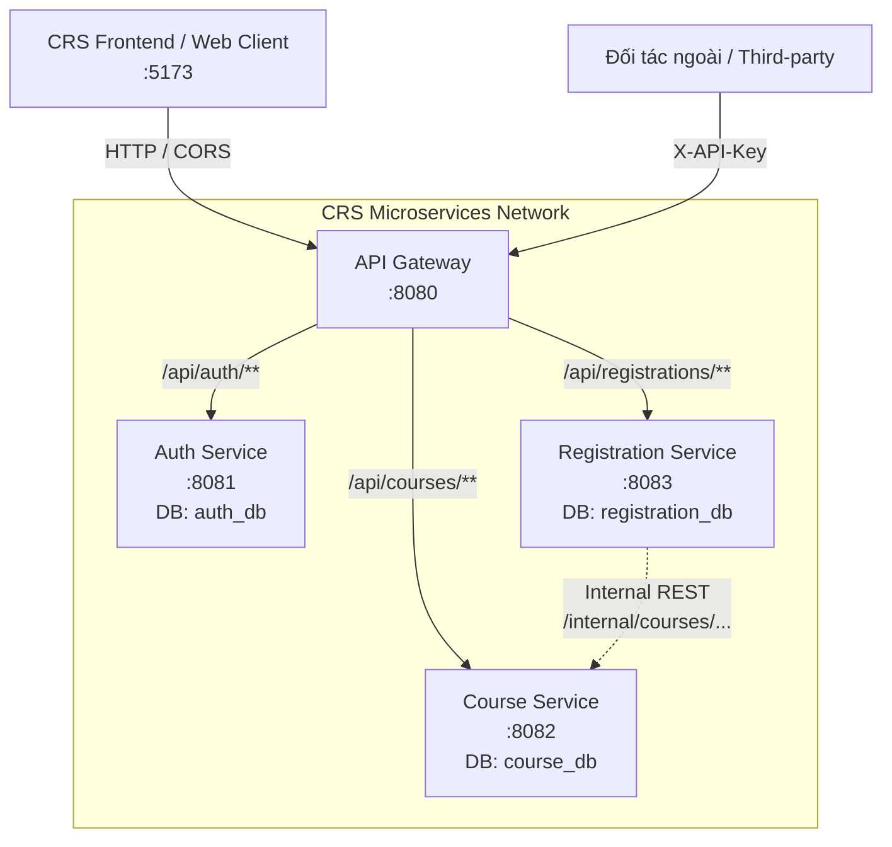

# Thiết Kế Biên Giới Service (Service Boundaries & Data Ownership)

## 1. Tổng Quan Hệ Thống CRS (Course Registration System)

Hệ thống Đăng ký học phần (CRS) được xây dựng theo kiến trúc **Microservices** phân tán. Toàn bộ hệ thống được chia thành các dịch vụ độc lập chịu trách nhiệm cho các miền nghiệp vụ chuyên biệt.

---

## 2. Danh Sách Dịch Vụ & Trách Nhiệm

| Tên Dịch Vụ | Cổng (Port) | Cơ Sở Dữ Liệu | Công Nghệ | Trách Nhiệm Nghiệp Vụ Chính |
| :--- | :--- | :--- | :--- | :--- |
| **`api-gateway`** | `8080` | *(Không có DB)* | Spring Cloud Gateway, WebFlux | Điểm vào duy nhất (Single Entry Point), định tuyến request, tiền kiểm tra JWT/API Key, xử lý CORS tập trung cho toàn bộ hệ thống. |
| **`auth-service`** | `8081` | `auth_db` | Spring Boot, Spring Security, JJWT, MySQL | Quản lý tài khoản (User, Student), xử lý đăng nhập, cấp phát và xác thực JWT token chứa Claims (userId, username, role, studentId). |
| **`course-service`** | `8082` | `course_db` | Spring Boot, Spring Data JPA, MySQL | Quản lý danh mục học phần (Course), tìm kiếm, lọc, phân trang, quản lý sĩ số (tổng số chỗ, số chỗ còn lại). Cung cấp API nội bộ trừ/hoàn chỗ. |
| **`registration-service`** | `8083` | `registration_db` | Spring Boot, Spring Data JPA, RestTemplate, MySQL | Quản lý giao dịch đăng ký học phần (Registration), điều phối nghiệp vụ đăng ký bằng cách gọi API nội bộ sang `course-service`. |
| **`crs-frontend`** | `5173` | *(Local Storage / State)* | React 18, TypeScript, Vite, Axios | Giao diện người dùng Web SPA: tra cứu danh sách môn học, tìm kiếm debounce, phân trang, xử lý 4 trạng thái (Loading, Success, Empty, Error). |

---

## 3. Nguyên Tắc Sở Hữu Dữ Liệu (Database Per Service & Data Ownership)

1. **Mỗi dịch vụ sở hữu cơ sở dữ liệu riêng biệt**:
   - `auth_db`: Bảng `users`, `students`, `roles`.
   - `course_db`: Bảng `courses`.
   - `registration_db`: Bảng `registrations`.
2. **Tuyệt đối không truy cập trực tiếp chéo database**:
   - `registration-service` **không** được kết nối trực tiếp vào `course_db` để truy vấn hoặc cập nhật bảng `courses`.
   - Mọi tương tác lấy dữ liệu hoặc thay đổi trạng thái của service khác bắt buộc phải thông qua giao thức **REST API**.
3. **Không tạo khoá ngoại vật lý (Foreign Key) xuyên cơ sở dữ liệu**:
   - Trong bảng `registrations` của `registration-service`, trường `course_id` và `student_id` được lưu dưới dạng số nguyên thuần túy (`Long`), không tạo ràng buộc Foreign Key sang bảng `courses` hay `students`.
4. **Độc lập triển khai (Autonomous Deployment)**:
   - Thay đổi cấu trúc bảng trong `course_db` không làm hỏng dữ liệu hoặc làm sập `registration-service` miễn là hợp đồng API (API Contract / DTO) được duy trì tương thích ngược.

---

## 4. Bảng Định Tuyến Tập Trung Tại API Gateway

Mọi yêu cầu từ Frontend hoặc bên ngoài đều gửi tới API Gateway tại cổng `8080`:

| Prefix Tuyến Đường | Đích Chuyển Tiếp (Forward URL) | Quyền Truy Cập | Mục Đích Sử Dụng |
| :--- | :--- | :--- | :--- |
| `/api/auth/**` | `http://localhost:8081` | **Public** | Đăng nhập (`/auth/login`), Đăng ký (`/auth/register`) |
| `/api/courses/**` | `http://localhost:8082` | **Public (GET)** / **ADMIN (POST, PUT, DELETE)** | Tra cứu môn học công khai, Admin quản lý thêm/sửa/xóa môn học |
| `/api/registrations/**` | `http://localhost:8083` | **JWT (STUDENT / ADMIN)** | Sinh viên đăng ký môn học, xem danh sách đã đăng ký, hủy đăng ký |
| `/api/public/courses/**` | `http://localhost:8082` | **API Key (`X-API-Key`)** | Tuyến đường dành cho hệ thống đối tác bên ngoài tích hợp |

> [!NOTE]
> Các endpoint nội bộ có tiền tố `/internal/**` (như `/internal/courses/{id}/reserve-seat`) **không được định tuyến qua Gateway** nhằm đảm bảo an toàn, chỉ cho phép các service trong mạng nội bộ gọi trực tiếp với nhau.
