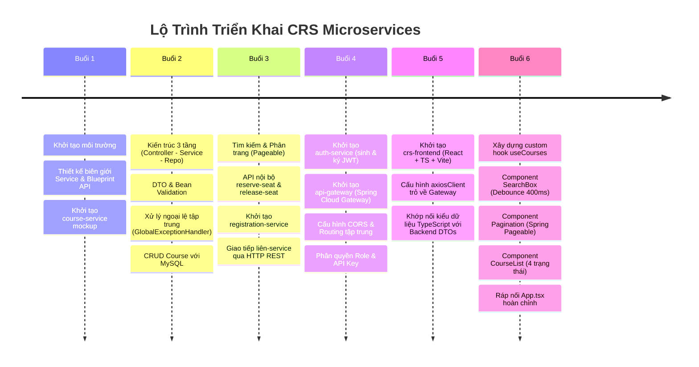

# Tổng Quan Tiến Trình Phát Triển Hệ Thống CRS (Buổi 1 — Buổi 6)

Tài liệu ghi nhận toàn bộ lộ trình kiến trúc, các cột mốc tính năng và công nghệ đã triển khai từ Buổi 1 đến Buổi 6 trong dự án **CRS Microservices** (Course Registration System).

---

## 1. Bản Đồ Tiến Trình Qua Từng Buổi Học



---

## 2. Chi Tiết Nội Dung Triển Khai Từng Buổi

### Buổi 1: Thiết Kế Biên Giới & Khởi Tạo Service Đầu Tiên
- **Mục tiêu**: Định hình kiến trúc phân tán ngay từ ngày đầu, tránh sai lầm về biên giới dữ liệu.
- **Kết quả**:
  - Thiết lập tài liệu thiết kế biên giới (`thiet-ke-bien-gioi-service.md`) và hợp đồng API sơ bộ (`blueprint-api.md`).
  - Phân định nguyên tắc *Database per Service*: mỗi service nắm giữ một schema DB riêng, không tạo khóa ngoại vật lý chéo DB.
  - Khởi tạo project Spring Boot đầu tiên: `course-service` (cổng 8082) với endpoint mockup.

### Buổi 2: Kiến Trúc 3 Tầng & CRUD Course Hoàn Chỉnh
- **Mục tiêu**: Tách bạch trách nhiệm các tầng trong `course-service`, chuẩn hóa DTO và kiểm soát lỗi đầu vào.
- **Kết quả**:
  - Phân tách 3 lớp: `CourseController` (HTTP request/response) $\rightarrow$ `CourseService` (Business logic) $\rightarrow$ `CourseRepository` (Spring Data JPA).
  - Tách rời Entity DB khỏi API Contract bằng `CourseDTO`.
  - Áp dụng Jakarta Bean Validation (`@NotBlank`, `@Min`, `@Max`).
  - Xử lý lỗi tập trung bằng `@RestControllerAdvice` (`GlobalExceptionHandler`), trả về định dạng JSON lỗi chuẩn.

### Buổi 3: Tìm Kiếm, Phân Trang & Giao Tiếp Liên-Service
- **Mục tiêu**: Tối ưu hiệu năng danh sách môn học và thiết lập giao tiếp HTTP giữa các microservices.
- **Kết quả**:
  - Bổ sung `findByTenMonHocContainingIgnoreCase` kết hợp Spring Data `Pageable` vào `course-service`.
  - Xây dựng 2 API nội bộ (Internal API): `/internal/courses/{id}/reserve-seat` và `/internal/courses/{id}/release-seat` có bọc `@Transactional`.
  - Khởi tạo service thứ hai: `registration-service` (cổng 8083, DB `registration_db`).
  - Sử dụng `RestTemplate` trong `registration-service` để gọi đồng bộ sang `course-service` khi sinh viên đăng ký hoặc hủy môn học.

### Buổi 4: Xác Thực JWT, API Gateway Tập Trung & Phân Quyền
- **Mục tiêu**: Xây dựng cơ chế bảo mật tập trung và điểm vào duy nhất cho toàn hệ thống.
- **Kết quả**:
  - Khởi tạo `auth-service` (cổng 8081, DB `auth_db`), triển khai xác thực tài khoản và cấp phát JWT token (JJWT).
  - Khởi tạo `api-gateway` (cổng 8080) bằng **Spring Cloud Gateway**, cấu hình bảng định tuyến (Routing) cho toàn bộ hệ thống.
  - Cấu hình **CORS** tập trung tại Gateway, giải quyết triệt để vấn đề Cross-Origin cho Frontend.
  - Áp dụng mô hình bảo mật nhiều lớp: Gateway kiểm tra routing/pre-flight, các service phía sau (`course-service`, `registration-service`) tự xác thực chữ ký JWT độc lập bằng `JwtAuthenticationFilter`.
  - Hỗ trợ tuyến đường riêng dùng `X-API-Key` cho đối tác thứ ba tích hợp.

### Buổi 5: Khởi Tạo Frontend React TypeScript & Kết Nối Gateway
- **Mục tiêu**: Thiết lập nền móng ứng dụng Frontend hiện đại, kết nối an toàn qua API Gateway.
- **Kết quả**:
  - Khởi tạo `crs-frontend` bằng Vite + React + TypeScript.
  - Tạo `axiosClient.ts` sử dụng biến môi trường `VITE_API_BASE_URL=http://localhost:8080`.
  - Định nghĩa hệ thống kiểu dữ liệu TypeScript (`Course`, `PagedResponse<T>`, `ApiErrorResponse`, `LoginResponseDTO`, `Registration`) khớp chính xác với DTO Backend.
  - Thực hiện kết nối thử nghiệm `GET /api/courses` qua Gateway thành công không bị chặn CORS.

### Buổi 6: UI Danh Sách Môn Học, Tìm Kiếm, Phân Trang & Xử Lý 4 Trạng Thái
- **Mục tiêu**: Xây dựng giao diện danh sách môn học hoàn chỉnh, tối ưu trải nghiệm người dùng và xử lý trọn vẹn mọi trạng thái API.
- **Kết quả**:
  - Tách logic gọi API ra khỏi component giao diện bằng custom hook **`useCourses`**, quản lý 4 trạng thái cốt lõi: `loading`, `success`, `empty`, `error`.
  - Component **`SearchBox`**: tích hợp cơ chế **Debounce (400ms)** giúp hạn chế việc gửi request dồn dập khi gõ phím.
  - Component **`Pagination`**: điều hướng trang linh hoạt theo định dạng 0-indexed của Spring Data Pageable, tự động ẩn khi chỉ có 1 trang.
  - Component **`CourseList`**: hiển thị bảng dữ liệu trực quan, cảnh báo màu đỏ khi hết chỗ (`soChoConLai === 0`), cung cấp nút **"Thu lai"** khi gặp lỗi mạng hoặc ngắt kết nối Gateway.
  - Tích hợp tại **`App.tsx`**: phối hợp nhịp nhàng giữa tìm kiếm, phân trang và hiển thị; tự động quay về trang 1 (`page = 0`) khi người dùng tìm kiếm từ khóa mới.

---

## 3. Cấu Trúc Toàn Bộ Dự Án CRS Đến Thời Điểm Hiện Tại

```text
crs-microservices/
├── api-gateway/                      # Spring Cloud Gateway (Port 8080)
│   ├── src/main/java/vn/edu/crs/api_gateway/
│   │   ├── config/CorsConfig.java
│   │   ├── filter/ApiKeyGatewayFilter.java
│   │   └── ApiGatewayApplication.java
│   └── pom.xml
│
├── auth-service/                     # Auth & JWT Service (Port 8081)
│   ├── src/main/java/vn/edu/crs/auth_service/
│   │   ├── controller/AuthController.java
│   │   ├── entity/User.java, Student.java, Role.java
│   │   ├── security/JwtUtils.java, SecurityConfig.java
│   │   └── AuthServiceApplication.java
│   └── pom.xml
│
├── course-service/                   # Course Catalog & Seat Management (Port 8082)
│   ├── src/main/java/vn/edu/crs/course_service/
│   │   ├── controller/CourseController.java, InternalCourseController.java
│   │   ├── service/CourseService.java
│   │   ├── repository/CourseRepository.java
│   │   ├── dto/CourseDTO.java
│   │   ├── exception/GlobalExceptionHandler.java
│   │   ├── security/JwtAuthenticationFilter.java
│   │   └── CourseServiceApplication.java
│   └── pom.xml
│
├── registration-service/             # Course Registration & Orchestration (Port 8083)
│   ├── src/main/java/vn/edu/crs/registration_service/
│   │   ├── controller/RegistrationController.java
│   │   ├── service/RegistrationService.java
│   │   ├── client/CourseClient.java
│   │   ├── entity/Registration.java
│   │   └── RegistrationServiceApplication.java
│   └── pom.xml
│
├── crs-frontend/                     # React TypeScript SPA (Port 5173)
│   ├── src/
│   │   ├── api/
│   │   │   ├── axiosClient.ts
│   │   │   ├── courseApi.ts
│   │   │   └── useCourses.ts         # Hook quản lý API & 4 trạng thái
│   │   ├── components/
│   │   │   ├── SearchBox.tsx         # Ô tìm kiếm có debounce 400ms
│   │   │   ├── Pagination.tsx        # Điều hướng phân trang 0-indexed
│   │   │   └── CourseList.tsx        # Render dữ liệu & 4 trạng thái
│   │   ├── types/
│   │   │   ├── apiError.ts
│   │   │   ├── auth.ts
│   │   │   ├── course.ts
│   │   │   └── registration.ts
│   │   ├── App.tsx                   # Trang chính điều phối các components
│   │   └── main.tsx
│   ├── .env
│   └── package.json
│
└── docs/                             # Thư mục tài liệu toàn diện của hệ thống
    ├── thiet-ke-bien-gioi-service.md
    ├── blueprint-api.md
    ├── kien-truc-he-thong.md
    ├── huong-dan-cai-dat-va-khoi-chay.md
    └── tong-quan-tien-trinh-buoi-1-den-6.md
```
